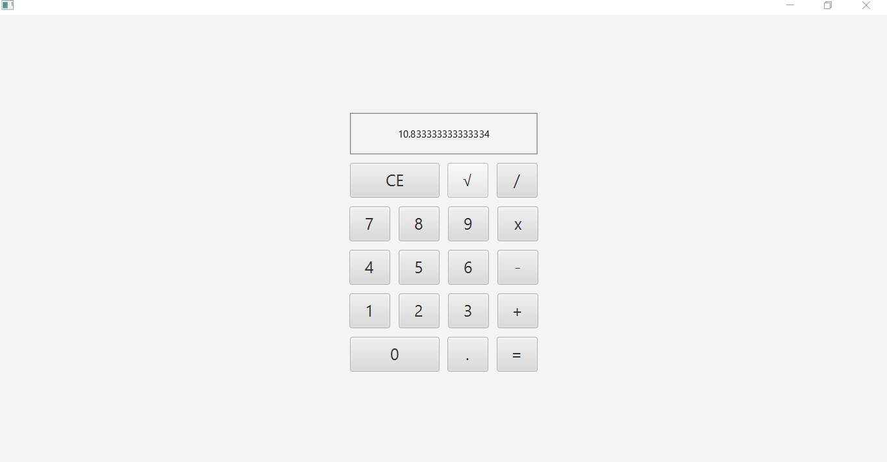

# CALCULADORA COM JAVAFX
👨‍🏫ESTE É UM EXEMPLO SIMPLES DE UMA CALCULADORA COM INTERFACE GRÁFICA, ONDE O CÓDIGO JAVAFX LIDA COM A INTERFACE E OS EVENTOS, ENQUANTO A LÓGICA MATEMÁTICA É SEPARADA NA CLASSE MODEL.

 <br>

## DESCRIÇÃO:
Esse projeto é uma **calculadora simples com interface gráfica** desenvolvida usando o JavaFX, uma Bíblioteca para criação de interfaces gráficas em Java. A aplicação permite realizar operações matemáticas básicas, como adição, subtração, multiplicação e divisão, além de calcular a raiz quadrada de um número. A interface gráfica é construída com a ajuda de arquivos FXML, e o comportamento é controlado pelo código Java.

## EXECUTANDO O PROJETO:
1. **Certifique-se de que o projeto esteja compilado:**
   Antes de executar o projeto, você deve garantir que ele foi compilado corretamente. Navegue até o diretório `./CODIGO`, e use o seguinte comando para compilar:

   ```bash
   mvn clean install
   ```

2. **Executar o projeto:**
   Para executar a aplicação com o Maven, usando a classe principal definida no seu `pom.xml`, use o comando:

   ```bash
   mvn javafx:run
   ```

3. **Usar a Calculadora:**
   - **Inserir Números:** Clique nos botões numéricos (de 0 a 9) para digitar um número. A tela de saída será atualizada à medida que você pressiona os botões.
   - **Escolher Operador:** Clique em um dos botões de operador (`+`, `-`, `x`, `/` ou `√`) para selecionar a operação que deseja realizar.
   - **Realizar Cálculo:** Após selecionar o operador e digitar um número, pressione o botão de igual (`=`) para obter o resultado da operação.
   - **Limpar a Tela:** Pressione o botão de **limpar** para resetar a calculadora e começar uma nova operação.
   - **Usar Ponto Decimal:** Se você deseja adicionar casas decimais, use o botão de ponto (`.`) para incluir a vírgula decimal no número.

## TECNOLOGIAS USADAS:
- [LINGUAGEM JAVA:](https://github.com/VILHALVA/CURSO-DE-JAVA) A linguagem de programação Java é amplamente utilizada para o desenvolvimento de aplicativos devido à sua portabilidade, segurança e robustez. Ela é uma escolha popular para desenvolver aplicativos desktop, web e móveis.

- [JAVAFX:](https://github.com/VILHALVA/CURSO-DE-JAVAFX) JavaFX é uma Bíblioteca (plataforma) de desenvolvimento rica para criar aplicações gráficas (GUI) modernas e sofisticadas em Java. Ele é projetado para substituir o Swing como a principal biblioteca para GUIs no Java. JavaFX oferece uma ampla gama de recursos que tornam o desenvolvimento mais intuitivo, flexível e visualmente atraente.

## CREDITOS:
- [PROJETO CRIADO PELO VILHALVA](https://github.com/VILHALVA)


